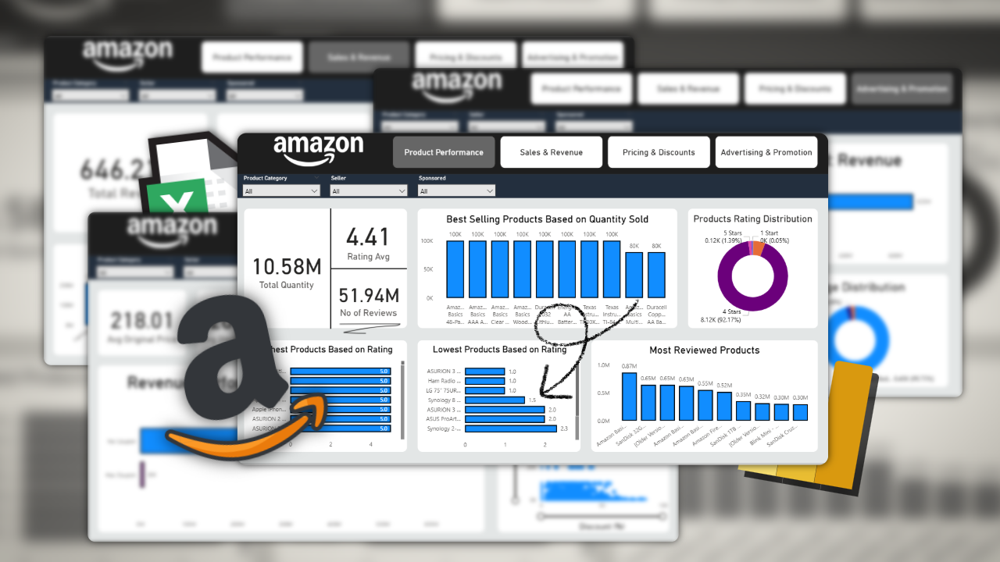
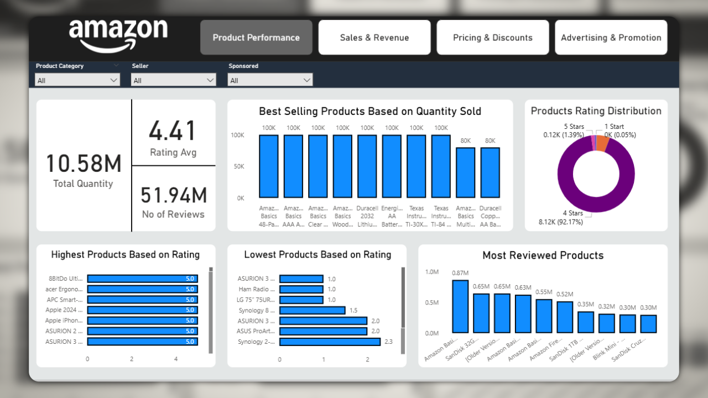
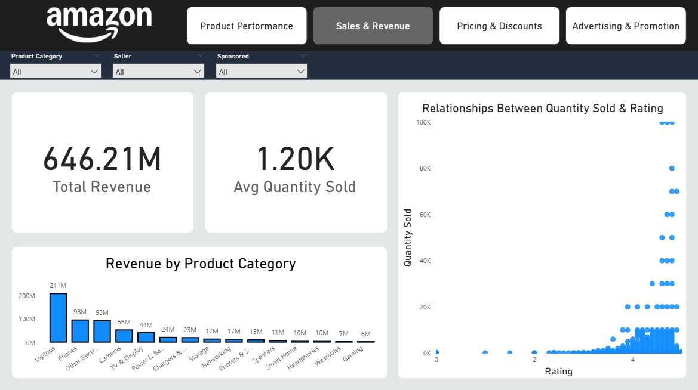
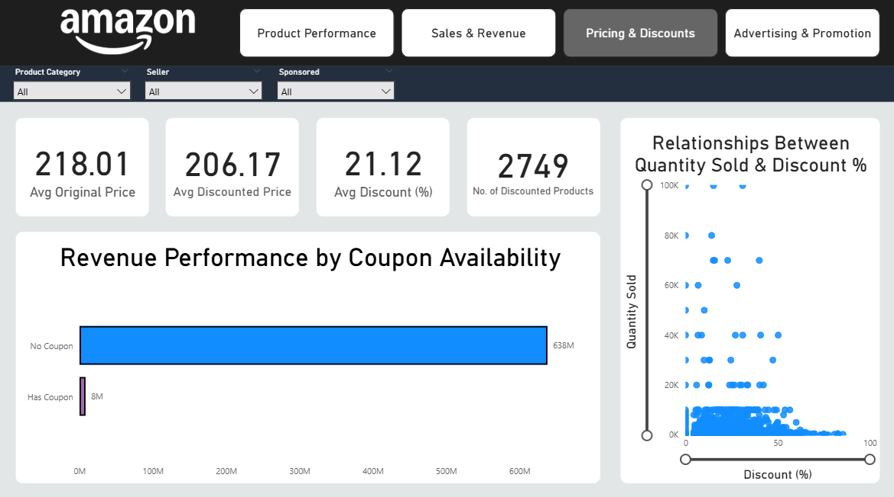
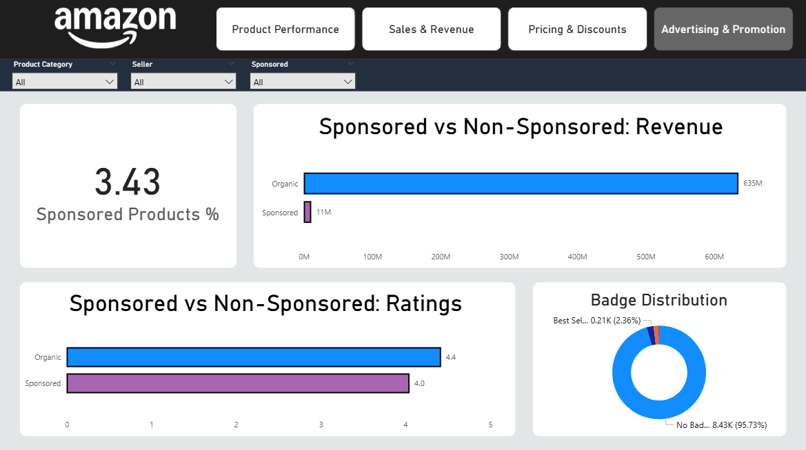

# Amazon Sales Analysis Dashboard (Sep 2025)

## 📌 About This Project

This project involves a comprehensive analysis of Amazon sales data through September 2025. The primary goal is to derive actionable insights into product performance, sales trends, revenue drivers, and the effectiveness of pricing and advertising strategies.

The analysis is presented through a series of interactive dashboards, breaking down data into four key areas:
1.  **Product Performance**
2.  **Sales & Revenue**
3.  **Pricing & Discounts**
4.  **Advertising & Promotion**

## Dataset

The dataset used for this analysis includes the following fields:
* Product Title
* Product Rating
* Total Reviews
* Quantity Sold Last Month
* Discounted Price
* Original Price
* Is Best Seller (Badge)
* Is Sponsored
* Coupon (Availability)
* Availability
* Image URL & Page URL
* Product Category
* Discount (%)

## 🛠️ Tools Used

* **UI Design:** **Figma**
* **Data Cleaning & Transformation (ETL):** **Power Query**
* **Data Analysis & Modeling:** **DAX** (Data Analysis Expressions)
* **Data Visualization:** **Power BI**

## 🚀 Key Business Insights & Recommendations

Based on the analysis, several key themes emerged:

1.  **Ratings are Paramount:** Product rating is the single most significant driver of sales volume. Products with ratings of 4.0 stars and above see exponentially higher sales.
2.  **Organic Performance is King:** The business is overwhelmingly driven by organic traffic and sales. Non-sponsored products and products without coupons account for the vast majority of revenue ($635M and $638M, respectively).
3.  **Ineffective Promotional Strategies:** Both **Coupons** and **Sponsored Ads** show minimal impact on overall revenue. Products *with* coupons generated only $8M (vs. $638M without), and sponsored products generated only $11M (vs. $635M organic).
4.  **Electronics Dominate Revenue:** **Laptops ($211M)** and **Phones ($98M)** are the two largest categories, contributing nearly half of the total revenue.
5.  **High Discounts Don't Equal High Sales:** The scatter plot shows that most high-volume sales occur at moderate discount levels (0-50%). Very steep discounts (50%+) are associated with low sales volume.

---

## 📊 Dashboard Showcase & Findings

### 1. Product Performance

This view focuses on customer satisfaction and product popularity metrics.

* **Average Rating:** **4.41 Stars**
* **Total Reviews:** 51.94M
* **Rating Distribution:** The customer base is overwhelmingly satisfied. **92.17%** of all products are rated 4 stars, and **1.39%** are 5 stars.
* **Best Selling Products:** "Amazon Basics" products (especially batteries and cables) dominate the top-selling items by quantity.
* **Most Reviewed Products:** "SanDisk" and "Amazon Basics" products lead in review counts, indicating high customer engagement and sales velocity.

### 2. Sales & Revenue

This dashboard provides a high-level overview of the financial performance and product landscape.

* **Total Revenue:** **$646.21M**
* **Average Quantity Sold (per product):** 1.20K
* **Revenue by Category:** **Laptops ($211M)** and **Phones ($98M)** are the clear leaders. Other electronics, cameras, and TV/displays follow as significant categories.
* **Quantity Sold vs. Rating:** There is a strong positive correlation. Sales volume increases dramatically as ratings approach and exceed 4.0 stars. Products rated below 3.5 have almost negligible sales volume.

### 3. Pricing & Discounts

This dashboard analyzes the impact of pricing strategies on sales and revenue.

* **Average Discount:** 21.12%
* **Coupon Availability vs. Revenue:** This is a critical insight. Products **without a coupon** generated **$638M** in revenue, while products **with a coupon** generated only **$8M**. This suggests the coupon strategy is either ineffective or applied to very low-volume items.
* **Quantity Sold vs. Discount %:** The relationship is not linear. Most high-volume sales (20K-100K units) happen when the discount is between 0% and 50%. Very high discounts (50-100%) do not correlate with high sales and are linked to low-volume items.

### 4. Advertising & Promotion

This final view assesses the effectiveness of paid promotions (sponsorships) and product badges.

* **Sponsored Products:** Only **3.43%** of products are sponsored.
* **Revenue: Sponsored vs. Non-Sponsored:** Organic (non-sponsored) products are the lifeblood of the business, generating **$635M** in revenue. Sponsored products contributed only **$11M**.
* **Ratings: Sponsored vs. Non-Sponsored:** Organic products have a slightly higher average rating (4.4) than sponsored products (4.0).
* **Badge Distribution:** The vast majority of products (95.73%) have no special badge. The "Best Seller" badge is held by 2.36% of products.

---

## Connect With Me
Thank you for reviewing my project. I am open to any feedback or discussions regarding this analysis, data visualization, or other opportunities.

Feel free to connect with me on LinkedIn!

